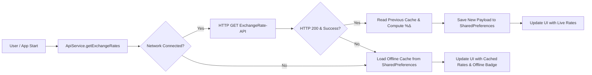
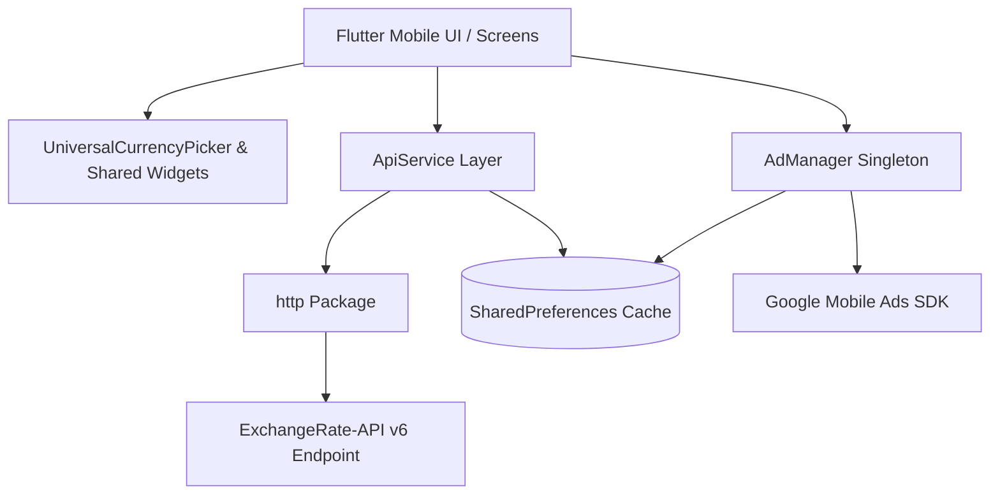
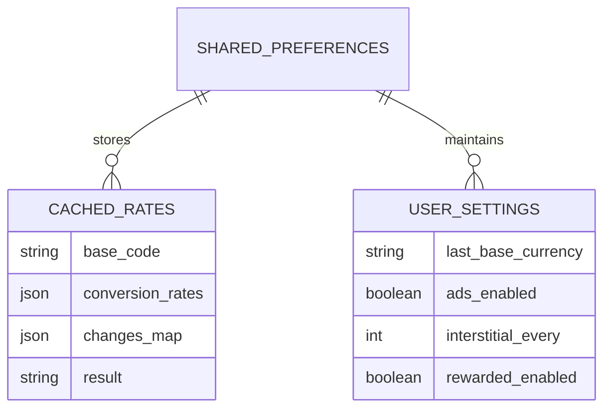

<div align="center">


# MateRate — Currency Converter App

**Real-Time Global Exchange Rate Engine & Currency Converter for Mobile**


</div>

> **Hero view — Live rates & conversion workspace**
>
> 📸 *Screenshot: Hero overview — place image at: assets/screenshots/001-home.png*
>
> A mobile workspace providing real-time exchange rates, percentage change analytics, offline resilience, and pair conversion.

---

## Table of Contents | فهرس المحتويات

- [Overview](#overview--نظرة-عامة)
- [Quick Start](#quick-start--بدء-سريع)
- [Quick Facts](#quick-facts--حقائق-سريعة)
- [Why This Project?](#why-this-project--لماذا-هذا-المشروع)
- [System Scope](#system-scope--نطاق-النظام)
- [Screenshots](#screenshots--لقطات-الشاشة)
- [Key Features](#key-features--الميزات-الرئيسية)
- [Module Overview](#module-overview--نظرة-عامة-على-الوحدات)
- [System Workflow](#system-workflow--سير-العمل)
- [Engineering Highlights](#engineering-highlights--نقاط-الإبداع-والتميز)
- [Technology Stack](#technology-stack)
- [Architecture Overview](#architecture-overview--نظرة-عامة-على-المعمارية)
- [Engineering Decisions](#engineering-decisions--القرارات-الهندسية)
- [Performance Considerations](#performance-considerations--اعتبارات-الأداء)
- [Technical Challenges](#technical-challenges--التحديات-التقنية)
- [UI/UX Design](#uiux-design)
- [Installation & Configuration](#installation--configuration--التثبيت-والإعداد)
- [Project Structure](#project-structure)
- [Services Provided](#services-provided)
- [API Overview](#api-overview)
- [Database Overview](#database-overview--نظرة-عامة-على-قاعدة-البيانات)
- [Security](#security--الأمان)
- [Deployment](#deployment--النشر)
- [Roadmap](#roadmap--خارطة-الطريق)
- [Development Team](#development-team)

---

## Overview | نظرة عامة

🇺🇸 **English**

MateRate is a mobile exchange rate and currency conversion application built with Flutter. It delivers real-time conversion rates across 160+ global currencies via ExchangeRate-API, supported by an offline caching mechanism powered by SharedPreferences. The application provides instant percentage change computation (%Δ), custom pair conversions, amount calculation, and Google Mobile Ads monetization within a clean, RTL-native Arabic and English interface.

🇸🇦 **العربية**

مات ريت (MateRate) هو تطبيق جوال متعدد المنصات لحساب وتتبع أسعار الصرف وتحويل العملات العالمية، مبني باستخدام إطار العمل Flutter. يقدم التطبيق أسعار صرف فورية لأكثر من 160 عملة عالمية عبر ExchangeRate-API، مدعوماً بآلية تخزين محلي لضمان العمل في وضع عدم الاتصال عبر SharedPreferences. يوفر التطبيق حساباً فورياً لنسب التغير المئوي (%Δ)، وتحويلاً بين أزواج العملات، وحساب المبالغ المخصصة، وإدارة إعلانات Google Mobile Ads ضمن واجهة مستخدم عربية وإنجليزية متجاوبة تدعم الاتجاه من اليمين إلى اليسار (RTL).

## Quick Start | بدء سريع

🇺🇸 **English**

Clone the repository, fetch dependencies via Flutter CLI, configure the API key in `lib/core/secrets/secrets.dart`, and run the application on a target device or emulator.

🇸🇦 **العربية**

استنسخ المستودع، وثبّت التبعيات عبر Flutter CLI، واضبط مفتاح الـ API في `lib/core/secrets/secrets.dart`، ثم شغّل التطبيق على محاكي أو جهاز حقيقي.

```bash
git clone https://github.com/mosaa65/MateRate---Currency-Converter-App.git
cd MateRate---Currency-Converter-App
flutter pub get
# Configure `lib/core/secrets/secrets.dart` with your ExchangeRate-API key
flutter run
```

Configure the required environment key before running; full details are documented in [Installation & Configuration](#installation--configuration--التثبيت-والإعداد).

## Quick Facts | حقائق سريعة

| Item | Value |
| --- | --- |
| Project type | Cross-platform Mobile & Web Currency Converter Application |
| Architecture | Modular Layered Architecture (Core, Services, Models, Screens, Widgets) |
| Frontend / Mobile | Flutter SDK ^3.7.2, Dart, Material 3, Custom Typography (Cairo, DM Serif Text) |
| Data & Services | ExchangeRate-API (v6 REST), SharedPreferences local caching |
| Analytics & Monetization | Google Mobile Ads (AdMob SDK ^6.0.0), Singleton AdManager with Frequency Capping |
| Repository | [GitHub — mosaa65/MateRate---Currency-Converter-App](https://github.com/mosaa65/MateRate---Currency-Converter-App.git) |
| License | MIT License |

---

## Why This Project? | لماذا هذا المشروع؟

🇺🇸 **English**

Financial transactions and currency tracking require accuracy, low latency, and offline access. Public REST APIs often fail when network connectivity drops. MateRate solves this by decoupling network availability from application usability: it caches live exchange rates locally, computes mathematical percentage changes between cached states and fresh payloads, and validates currency selection rules dynamically.

🇸🇦 **العربية**

تتطلب المعاملات المالية ومتابعة أسعار العملات دقة عالية، واستجابة سريعة، وإمكانية الوصول حتى عند انقطاع الإنترنت. تؤدي انقطاعات الشبكة إلى فشل الواجهات العادية. يحل MateRate هذه المشكلة بفصل توفر الشبكة عن قابلية استخدام التطبيق: حيث يخزن أسعار الصرف محلياً، ويحسب التغير المئوي الرياضياتي بين الحالات المخزنة والبيانات الجديدة، ويتحقق من قواعد اختيار العملات ديناميكياً.

## System Scope | نطاق النظام

🇺🇸 **English**

- **Live Rates Engine:** Real-time fetching of 160+ world currency rates relative to any selected base currency.
- **Offline Resilience:** SharedPreferences JSON snapshot caching with automatic fallback when network requests fail.
- **Trend Analytics:** Local computation of percentage changes (%Δ = ((new-old)/old)*100) to highlight currency appreciation/depreciation.
- **Pair & Amount Conversion:** Dedicated conversion screens for direct exchange pairs and arbitrary custom amounts.
- **Monetization & Ad Controls:** AdMob integration supporting Top/Bottom Banners, Interstitial frequency caps, and Rewarded Ads with user preferences.
- **RTL & Localization:** Native Arabic language support, Cairo & DM Serif typography, search-enabled bottom-sheet currency picker, and flag emoji generation.

🇸🇦 **العربية**

- **محرك الأسعار الحية:** جلب فوري لأسعار أكثر من 160 عملة عالمية بالنسبة لأي عملة أساسية محددة.
- **المرونة دون اتصال:** تخزين مؤقت للهياكل في SharedPreferences مع استرجاع تلقائي عند تعثر الاتصال بالشبكة.
- **تحليلات الاتجاه:** حساب محلي لنسب التغير المئوية (%Δ = ((new-old)/old)*100) لإبراز صعود وهبوط العملات.
- **التحويل المزدوج والمبالغ:** شاشات مخصصة لتحويل أزواج العملات المباشرة والمبالغ المخصصة مع حساب فوري.
- **إدارة الإعلانات:** دمج AdMob لدعم إعلانات Banner العلوية والسفلية، والإعلانات البينية المتكررة، وإعلانات المكافآت مع التحكم بالتفضيلات.
- **الدعم العربي وRTL:** دعم كامل للغة العربية، وخطوط القاهرة وDM Serif، ومنتقي عملات يتيح البحث وتوليد أعلام الدول.

---

## Screenshots | لقطات الشاشة

🇺🇸 **English**

Select any image to view it at full size. The verified UI captures live in `assets/screenshots/`.

🇸🇦 **العربية**

اضغط على أي صورة لعرضها بالحجم الكامل. تتوفر لقطات الواجهة الموثقة في `assets/screenshots/`.

### Core Workflows | المسارات الأساسية

| Home Screen | Pair Conversion | Amount Conversion |
| --- | --- | --- |
| 📸 *Screenshot: Home screen with live rates — place image at: assets/screenshots/001-home.png*<br><sub>Core — live rates and search</sub> | 📸 *Screenshot: Pair conversion screen — place image at: assets/screenshots/002-pair-conversion.png*<br><sub>Conversion — direct pair exchange</sub> | 📸 *Screenshot: Amount conversion screen — place image at: assets/screenshots/003-amount-conversion.png*<br><sub>Conversion — custom amount calculation</sub> |

### Settings and Administration | الإعدادات والإدارة

| Currency Picker | Ad Settings | Developer Info |
| --- | --- | --- |
| 📸 *Screenshot: Universal currency picker — place image at: assets/screenshots/004-currency-picker.png*<br><sub>UI — searchable currency sheet</sub> | 📸 *Screenshot: Ad settings screen — place image at: assets/screenshots/005-ad-settings.png*<br><sub>Settings — user ad preferences</sub> | 📸 *Screenshot: Developer info screen — place image at: assets/screenshots/006-developer-info.png*<br><sub>Info — team and branding</sub> |

### Mobile Experience | تجربة الجوال

| Mobile Home | Mobile Pair View | Mobile Settings |
| --- | --- | --- |
| 📸 *Screenshot: Mobile home view — place image at: assets/screenshots/007-mobile-home.png*<br><sub>Mobile — responsive rate list</sub> | 📸 *Screenshot: Mobile pair conversion — place image at: assets/screenshots/008-mobile-pair.png*<br><sub>Mobile — touch-friendly converter</sub> | 📸 *Screenshot: Mobile settings view — place image at: assets/screenshots/009-mobile-settings.png*<br><sub>Mobile — preferences & privacy</sub> |

---

## Key Features | الميزات الرئيسية

🇺🇸 **English**

- 💱 **Real-Time Exchange Rates:** Connects to ExchangeRate-API v6 endpoints to query current rates across global currencies.
- 📴 **Offline Caching System:** Automatically saves JSON payloads to local device storage, enabling seamless offline rate viewing.
- 📈 **Percentage Change Calculation:** Computes %Δ locally between previous and newly fetched conversion rates to illustrate market shifts.
- 🔍 **Universal Search & Picker:** Search currencies by ISO code (e.g. USD, EUR) or full English/Arabic names with flag emoji generation.
- 🎯 **Pair & Custom Amount Conversion:** Dedicated conversion workflows with dynamic input validation preventing identical currency pairings.
- 📢 **Controlled Monetization:** Features Google Mobile Ads integration with configurable frequency caps, test unit fallback, and user toggle switches.
- 🎨 **Arabic RTL & Custom Typography:** Features Material 3 components styled with Cairo-SemiBold, DM Serif Text, and PoetsenOne fonts.

🇸🇦 **العربية**

- 💱 **أسعار صرف حية:** اتصال بمخرجات ExchangeRate-API v6 للاستعلام عن أسعار العملات العالمية لحظياً.
- 📴 **نظام تخزين محلي:** حفظ تلقائي لبيانات JSON في ذاكرة الجهاز لتوفير عرض سلس أثناء غياب الشبكة.
- 📈 **حساب التغير المئوي:** قياس %Δ محلياً بين الأسعار السابقة والجديدة لإظهار اتجاهات الصعود والهبوط.
- 🔍 **بحث ومنتقي شامل:** بحث عن العملات برموز ISO (مثل USD، EUR) أو الأسماء الكاملة مع توليد تلقائي لأعلام الدول.
- 🎯 **تحويل الأزواج والمبالغ:** مسارات تحويل مخصصة مع تحقق ديناميكي يمنع مطابقة عملتي الأساس والهدف.
- 📢 **إدارة إعلانات مضبوطة:** دمج لخدمات Google Mobile Ads بسقف تكرار مرن ومفاتيح تبديل للتجارب والإنتاج.
- 🎨 **دعم كامل للغة العربية وRTL:** مكونات Material 3 مجهزة بخطوط Cairo وDM Serif وPoetsenOne لتجربة عربية أصيلة.

## Module Overview | نظرة عامة على الوحدات

🇺🇸 **English**

The application is structured into functional modules according to domain responsibilities.

🇸🇦 **العربية**

تتوزع وحدات التطبيق وفق المسؤوليات الوظيفية والمجالات التشغيلية.

| Module | Purpose | Responsibilities and Main Capabilities |
| --- | --- | --- |
| Rates Home (`lib/screens/home`) | Primary rate monitoring workspace | Fetches live rates, allows base currency switching, displays percent changes, and integrates rate search. |
| Conversion (`lib/screens/conversion`) | Pair and amount calculation | Handles pair exchange rate lookups, custom amount computations, and rate detail breakdowns. |
| API Service (`lib/services/api`) | Remote data fetching & caching | Interacts with ExchangeRate-API, manages SharedPreferences caching, and computes local percent changes. |
| Ad Manager (`lib/services/ads`) | Monetization engine | Singleton managing Banner, Interstitial, and Rewarded ads with frequency capping and settings integration. |
| Shared Components (`lib/widgets`) | Reusable UI widgets | Provides `UniversalCurrencyPicker` bottom sheet, custom bar widgets, and search listeners. |
| Application Core (`lib/core`) | System configuration | Maintains global color tokens (`AppColors`), API keys (`Secrets`), and app-wide constants. |
| Settings & Info (`lib/screens/settings`) | User preferences & metadata | Manages ad preferences (`AdSettingsScreen`), app background (`AboutAppScreen`), and developer details (`DeveloperInfoScreen`). |

## System Workflow | سير العمل

🇺🇸 **English**

The rate fetching and offline fallback workflow is executed by `ApiService.getExchangeRates()` and its persistent cache layer.

🇸🇦 **العربية**

ينفذ سير عمل جلب الأسعار والاسترجاع عند انقطاع الاتصال عبر `ApiService.getExchangeRates()` وطبقة التخزين المؤقت المحفوظة.



---

## Engineering Highlights | نقاط الإبداع والتميز

🇺🇸 **English**

- **Delta Change Computation:** Computes local percentage changes (`%Δ = ((new-old)/old) * 100`) by comparing newly fetched JSON payloads with stored SharedPreferences cache snapshots before updating state.
- **Fault-Tolerant Ad Architecture:** Implemented `AdManager` as a Singleton with async initialization wrapped in try/catch blocks to ensure ad SDK failures never block primary application boot.
- **Dynamic Flag Generation:** `UniversalCurrencyPicker` transforms 2-letter ISO country codes into Unicode Regional Indicator Symbols dynamically without storing external static image assets.
- **Clean Response Modeling:** Custom response parsing (`PairConversionResponse.fromJson`) encapsulates numeric type casting (`int` vs `double`) and network error handling outside UI widgets.

🇸🇦 **العربية**

- **حساب التغير المئوي:** حساب التغير المئوي محلياً (`%Δ = ((new-old)/old) * 100`) بمقارنة بيانات JSON الجديدة باللقطة المحفوظة في SharedPreferences قبل تحديث الواجهة.
- **معمارية إعلانات مرنة:** تطبيق `AdManager` كنمط Singleton مع تهيئة غير متزامنة مغلفة بـ try/catch لضمان عدم تأثير فشل SDK الإعلانات على تشغيل التطبيق.
- **توليد الأعلام الديناميكي:** يحول `UniversalCurrencyPicker` رمزي الدولة ISO إلى رموز مؤشرات مناطق Unicode بشكل فوري دون الحاجة لتخزين أصول صور خارجية.
- **نمذجة استجابات نظيفة:** يعزل `PairConversionResponse.fromJson` التحويلات العددية ومعالجة أخطاء الشبكة بعيداً عن عناصر الواجهة.

## Technology Stack

| Category | Technology | Version / Evidence |
| --- | --- | --- |
| Programming Languages | Dart | ^3.7.2 (SDK constraint) |

### Frontend and UI

| Category | Technology | Version / Evidence |
| --- | --- | --- |
| Framework | Flutter SDK | ^3.7.2 |
| UI Components | Material Design 3 & Cupertino Icons | Cupertino Icons ^1.0.8 |
| Custom Fonts | Cairo, DM Serif Text, PoetsenOne, Pacifico | Declared in `pubspec.yaml` |

### Backend, Data, and Network

| Category | Technology | Version / Evidence |
| --- | --- | --- |
| Network Client | http | ^1.3.0 |
| Data Provider | ExchangeRate-API v6 | `https://v6.exchangerate-api.com/v6/` |
| Local Storage | shared_preferences | ^2.5.3 |
| Connectivity | connectivity_plus | ^6.1.3 |
| External Launcher | url_launcher | ^6.3.1 |

### Monetization and Tooling

| Category | Technology | Version / Evidence |
| --- | --- | --- |
| Monetization | google_mobile_ads | ^6.0.0 |
| App Launcher Icons | flutter_launcher_icons | ^0.14.3 |
| Quality & Linting | flutter_lints | ^5.0.0 |

## Architecture Overview | نظرة عامة على المعمارية

🇺🇸 **English**

MateRate follows a clean Layered Architecture separating presentation (`screens`, `widgets`), domain models (`models`), data services (`services`), and application core configuration (`core`). The browser or mobile client communicates with external APIs through typed service boundaries, while SharedPreferences serves as the local data store for offline continuity.

🇸🇦 **العربية**

يتبع MateRate معمارية الطبقات النظيفة التي تفصل بين العرض (`screens`, `widgets`)، ونماذج المجال (`models`)، وخدمات البيانات (`services`)، وإعدادات المكونات الأساسية (`core`). يتواصل العميل مع واجهات البرمجة الخارجية عبر خدمات محددة الأنواع، بينما تعمل SharedPreferences كاستمرار للبيانات المحلية في وضع عدم الاتصال.



## Engineering Decisions | القرارات الهندسية

🇺🇸 **English**

The architectural decisions below are derived directly from codebase evidence in `lib/`.

🇸🇦 **العربية**

التبريرات التالية مستنتجة مباشرة من أدلة الكود المصدري في المجلد `lib/`.

| Decision | Repository Evidence | Engineering Rationale |
| --- | --- | --- |
| Local JSON Cache via SharedPreferences | `ApiService._cacheKey` reads and writes stringified JSON using `SharedPreferences`. | Ensures instant offline startup and zero downtime when external networks fail or rates are rate-limited. |
| Local Delta (%Δ) Calculation | `_computePercentChanges` calculates percentage changes between old cached JSON and new network JSON. | Eliminates reliance on paid API delta tiers by performing mathematical comparative analysis on client hardware. |
| Singleton Pattern for AdManager | `AdManager._internal()` factory pattern with static instance check. | Prevents redundant MobileAds initialization calls and memory leaks caused by duplicated banner/interstitial listeners. |
| Dynamic ISO-to-Emoji Flag Renderer | `_flagEmoji(code)` maps 2-letter ISO currency prefixes to Unicode code points (`0x1F1E6`). | Eliminates hundreds of image asset dependencies, reducing APK/IPA bundle size while maintaining visual quality. |
| Explicit Type Safety in Pair Conversion | `PairConversionResponse.fromJson` uses `_toDouble` parser helper. | Prevents runtime `TypeError` crashes caused by API variations returning numeric values as integer vs double. |

## Performance Considerations | اعتبارات الأداء

🇺🇸 **English**

The following performance characteristics are enforced by implementation design.

🇸🇦 **العربية**

تُطبق خصائص الأداء التالية بواسطة تصميم التنفيذ الهيكلي.

| Evidence | Implementation Detail | Practical Effect / Boundary |
| --- | --- | --- |
| Synchronous Memory Read on Boot | `SharedPreferences.getInstance()` preloads cached rate JSON during `initState()`. | Enables zero-latency initial UI rendering before network HTTP calls resolve. |
| Lazy Ad Loading & Frequency Capping | `AdManager.maybeShowInterstitial()` uses an event counter before invoking `show()`. | Avoids intrusive user experience degradation and minimizes background network calls. |
| Minimal Asset Footprint | Dynamic Unicode flag rendering replaces static flag image assets. | Keeps application binary size compact and improves memory efficiency during list rendering. |
| Network De-duplication | Base currency selection checks `if (newCode == baseCurrency) return;`. | Prevents redundant API bandwidth consumption when re-selecting active currency. |

## Technical Challenges | التحديات التقنية

🇺🇸 **English**

- **Network Volatility & Offline State:** Financial users require rates even without connectivity. The application implements persistent JSON caching and offline error recovery.
- **Dynamic Value Representation:** API rate responses mix integer and double values depending on currency scale. Strong typing helper `_toDouble` ensures strict type safety.
- **User Experience vs Monetization Balance:** Frequent ads frustrate users. An event counter frequency cap and complete ad toggle setting balance revenue with usability.
- **RTL Language & Typography:** Arabic interface alignment requires consistent font rendering and right-to-left layout constraints across all device dimensions.

🇸🇦 **العربية**

- **تقلب الشبكة والعمل دون اتصال:** يحتاج مستخدمو الخدمات المالية إلى الأسعار دائماً. يطبق التطبيق تخزيناً دائمياً لـ JSON مع استعادة سريعة عند الخطأ.
- **تمثيل القيم الديناميكية:** تعيد API أرقاماً صحيحة وعشرية حسب مقياس العملة. تضمن الدالة المساعدة `_toDouble` الأمان النوعي الصارم.
- **موازنة تجربة المستخدم والإعلانات:** تؤدي الإعلانات المتكررة إلى إزعاج المستخدمين. يضمن سقف التكرار ومفاتيح التفضيلات التوازن بين الإيرادات والاستخدام.
- **دعم اللغة العربية والخطوط:** يتطلب محاذاة الواجهة العربية اتساقاً في تقديم الخطوط واتجاه النصوص من اليمين إلى اليسار.

## UI/UX Design

| Element | Tool/Library |
| --- | --- |
| Color System | `AppColors` custom palette (Teal primary & secondary tokens) |
| Typography | Cairo-SemiBold (Arabic primary), DM Serif Text, PoetsenOne, Pacifico |
| Design System | Material Design 3 with custom bottom sheets and rounded inputs |
| Icons | CupertinoIcons & Material Icons |
| Monetization Layout | Fixed Top & Bottom Ad Banners integrated into SafeArea |
| Interaction Feedback | Material SnackBars and dynamic search filtering |
| Localization | Native RTL orientation and Arabic text direction |

## Installation & Configuration | التثبيت والإعداد

1. Ensure Flutter SDK (^3.7.2) and Dart are installed on your environment.
2. Clone the repository and navigate into the project root:

```bash
git clone https://github.com/mosaa65/MateRate---Currency-Converter-App.git
cd MateRate---Currency-Converter-App
```

3. Install required Flutter packages:

```bash
flutter pub get
```

4. Configure the API Key in `lib/core/secrets/secrets.dart`:

```dart
class Secrets {
  static const String exchangeRateApiKey = 'YOUR_EXCHANGE_RATE_API_KEY';
}
```

5. Run the application on your target device or emulator:

```bash
flutter run
```

6. To generate release binaries for Android or iOS:

```bash
flutter build apk --release
# Or for iOS
flutter build ios --release
```

## Project Structure

```text
MateRate---Currency-Converter-App/
├── assets/
│   ├── app_icon.jpg
│   ├── developer.jpg
│   └── inama-soft-logo.ico
├── fonts/
│   ├── Cairo/
│   ├── DM_Serif_Text/
│   ├── Pacifico-Regular.ttf
│   └── PoetsenOne-Regular.ttf
├── lib/
│   ├── core/
│   │   ├── constants/
│   │   │   └── app_colors.dart
│   │   └── secrets/
│   │       └── secrets.dart
│   ├── models/
│   │   └── responses/
│   │       ├── exchange_rate_response.dart
│   │       └── pair_conversion_response.dart
│   ├── screens/
│   │   ├── contact/
│   │   │   └── contact_screen.dart
│   │   ├── conversion/
│   │   │   ├── amount_conversion_screen.dart
│   │   │   ├── pair_conversion_screen.dart
│   │   │   └── rate_details_screen.dart
│   │   ├── home/
│   │   │   └── home_screen.dart
│   │   └── settings/
│   │       ├── about_app_screen.dart
│   │       ├── ad_settings_screen.dart
│   │       └── developer_info_screen.dart
│   ├── services/
│   │   ├── ads/
│   │   │   └── ad_manager.dart
│   │   └── api/
│   │       └── api_service.dart
│   ├── widgets/
│   │   ├── bar_widget.dart
│   │   └── universal_currency_picker.dart
│   └── main.dart
├── analysis_options.yaml
├── pubspec.lock
└── pubspec.yaml
```

## Services Provided

| Service | Value Delivered |
| --- | --- |
| Real-time Rate Query | Provides instant rate lookups across 160+ world currencies for accurate financial conversion. |
| Offline Availability | Enables users to inspect exchange rates without active internet connection via cached data. |
| Currency Pair Converter | Enables direct conversion between specific currency pairs with immediate result outputs. |
| Custom Amount Calculator | Facilitates real-time calculation of arbitrary monetary amounts between selected currencies. |
| Trend & Delta Insights | Computes local percentage variations to help users track currency market fluctuations. |

## API Overview

> **Integration Boundary:** MateRate consumes the ExchangeRate-API v6 REST service for market exchange data.

| Endpoint | Method | Responsibility |
| --- | --- | --- |
| `latest/{base}` | GET | Fetches live conversion rates for all supported currencies relative to `{base}`. |
| `pair/{base}/{target}` | GET | Retrieves direct exchange rate for a specific currency pair. |
| `pair/{base}/{target}/{amount}` | GET | Calculates total converted value for a specific `{amount}` between `{base}` and `{target}`. |
| `codes` | GET | Returns array of supported 3-letter ISO currency codes and full country names. |

## Database Overview | نظرة عامة على قاعدة البيانات

🇺🇸 **English**

The application uses SharedPreferences key-value persistent storage for offline cache management and user preferences. Exchange rate JSON structures are serialized as JSON strings under base-currency keys (`cached_rates_<BASE>`), storing rates, timestamps, and locally computed percentage changes.

🇸🇦 **العربية**

يستخدم التطبيق وحدة التخزين الدائمة المفتاح-القيمة SharedPreferences لإدارة التخزين المؤقت وتفضيلات المستخدم. تُحفظ بيانات JSON لأسعار الصرف كنصوص JSON مشفرة مفهرسة برمز العملة الأساسية (`cached_rates_<BASE>`)، متضمنة الأسعار، والطباعة الزمنية، ونسب التغير المحسوبة محلياً.



## Security | الأمان

🇺🇸 **English**

- **Secret Isolation:** API keys are isolated within `lib/core/secrets/secrets.dart` and excluded from public version control.
- **Transport Security:** All HTTP network queries enforce HTTPS protocol (`https://v6.exchangerate-api.com/v6/`).
- **Validation Guards:** `UniversalCurrencyPicker` enforces validation logic preventing identical base and target currency selections.
- **Safe Monetization Bounds:** AdManager uses official test Ad Unit IDs during development (`testMode = true`) to prevent AdMob account suspensions.

🇸🇦 **العربية**

- **عزل الأسرار:** تُعزل مفاتيح واجهات البرمجة داخل `lib/core/secrets/secrets.dart` وتُستثنى من التتبع العام.
- **أمان النقل:** تعتمد جميع الاستعلامات الشبكية بروتوكول التشفير الفائق HTTPS.
- **حماية التحقق:** يطبق `UniversalCurrencyPicker` قواعد تحقق تمنع اختيار العملة ذاتها كعملة أساسية ومستهدفة.
- **حدود الإعلانات الآمنة:** يستخدم AdManager معرفات اختبار رسمية أثناء التطوير تجنباً لتقييد حساب AdMob.

## Testing

Automated testing is configured using Flutter's native test suite (`flutter_test`). Execute tests via CLI:

```bash
flutter test
```

## Deployment | النشر

🇺🇸 **English**

MateRate is configured for cross-platform deployment on Android, iOS, and Web. Production release builds are generated through the standard Flutter build pipeline.

🇸🇦 **العربية**

تم إعداد MateRate للنشر على منصات Android وiOS وWeb. وتنتج حزم الإنتاج عبر مسار بناء Flutter القياسي.

```bash
# Android Release APK / App Bundle
flutter build apk --release
flutter build appbundle --release

# iOS Release Build
flutter build ios --release
```

**Live Repository:** https://github.com/mosaa65/MateRate---Currency-Converter-App.git

## Roadmap | خارطة الطريق

🇺🇸 **English**

Planned enhancements for future product releases:

- [ ] Historical rate charts and interactive trend visualizers.
- [ ] Push notifications for custom exchange rate thresholds and price alerts.
- [ ] Favorite currency pairs bookmarking for fast access.
- [ ] Multi-language UI support expanding beyond Arabic and English.
- [ ] Dark Mode visual theme option.

🇸🇦 **العربية**

التحسينات المخططة للإصدارات المستقبليّة:

- [ ] رسوم بيانية تاريخية وأدوات تفاعلية لمتابعة الاتجاهات.
- [ ] إشعارات فورية لتنبيهات أسعار الصرف عند تجاوز حدود معينة.
- [ ] إمكانية حفظ أزواج العملات المفضلة للوصول السريع.
- [ ] توسيع دعم اللغات ليشمل لغات إضافية بجانب العربية والإنجليزية.
- [ ] خيار السمة الداكنة (Dark Mode).

## Development Team

| Name | Responsibilities |
| --- | --- |
| **المهندس موسى** (Mousa Gamil Al-Awadhi) | Technical Leadership, System Architecture, Mobile Engineering, API Integration, Database & Offline Storage, Documentation |

---

<div align="center">


**Made with ❤️ by Inama Soft — Collaborative Development Group**

Mousa Gamil Al-Awadhi

Ibb, Yemen · [mousa.mc13@gmail.com](mailto:mousa.mc13@gmail.com) · [+967 772 217 218](tel:+967772217218)

[Website](https://inma-soft.vercel.app) · [LinkedIn](https://www.linkedin.com/in/mousa-al-awadhi-6518633a8) · [GitHub](https://github.com/mosaa65) · [Live Project](https://github.com/mosaa65/MateRate---Currency-Converter-App)

تم التطوير بواسطة فريق Inama Soft © 2026

</div>
